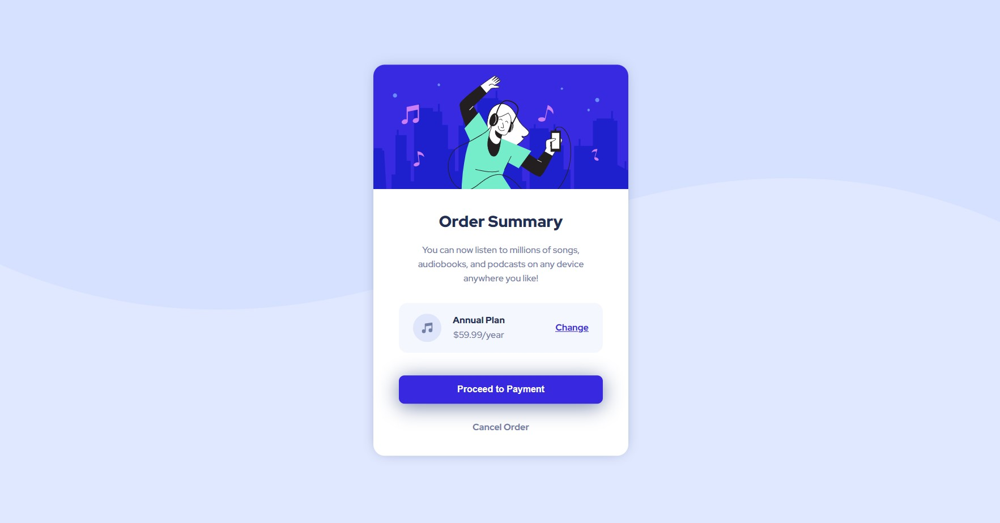

# Frontend Mentor - Order summary card solution

This is a solution to the [Order summary card challenge on Frontend Mentor](https://www.frontendmentor.io/challenges/order-summary-component-QlPmajDUj). Frontend Mentor challenges help you improve your coding skills by building realistic projects. 

## Table of contents

- [Overview](#overview)
  - [The challenge](#the-challenge)
  - [Screenshot](#screenshot)
  - [Links](#links)
- [My process](#my-process)
  - [Built with](#built-with)
  - [What I learned](#what-i-learned)
  - [Useful resources](#useful-resources)
- [Author](#author)


## Overview

### The challenge

Users should be able to:

- See hover states for interactive elements

### Screenshot



### Links

- Solution URL: https://github.com/nageshpk/Order-summary-component
- Live Site URL: https://nageshpk.github.io/Order-summary-component/

## My process

### Built with

- Semantic HTML5 markup
- CSS custom properties
- Flexbox

### What I learned

This project wwas made using basic HTML and CSS flexbox. Few things I had to learn were applying shadow effects, and how to resize .svg images. Have attached code snippets below.


```css
background-size: cover;
background-repeat: no-repeat;
box-shadow: 0 0 25px -10px hsl(224, 23%, 55%);
line-height: 25px;

button:hover {
    background-color: hsl(223, 47%, 23%);
    cursor: pointer;
}
```

### Useful resources

- [Example resource 1](https://www.w3schools.com/cssref/css3_pr_background-size.asp) - This helped me to resize the background image of the page.
- [Example resource 2](https://www.freecodecamp.org/news/css-button-style-hover-color-and-background/) - This is an amazing article which helped me in understanding hover effect which is the pseudo class effect.
- [Example resource 2](https://www.w3schools.com/csSref/sel_hover.asp) - Another article on CSS hover effect.
- [Example resource 2](https://www.w3schools.com/cssref/pr_dim_line-height.asp) - An interactive article on CSS line-height property.

## Author

- Frontend Mentor - [@nageshpk](https://www.frontendmentor.io/profile/nageshpk)
